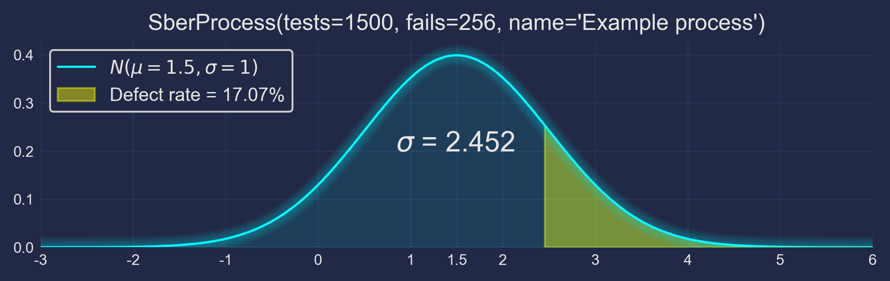
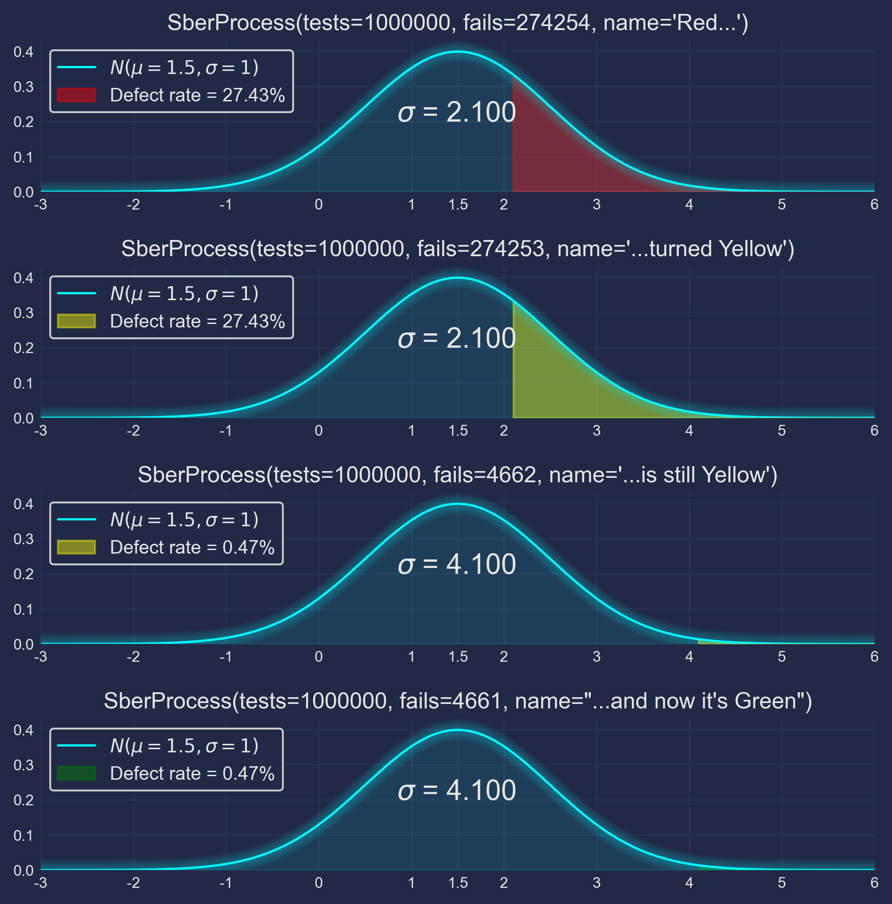

## Simple web app to evaluate a process with the "6 Sigma" approach

### Usage

```python
import json
from io import BytesIO

import requests
from PIL import Image
```

```python
url = "https://six-sigma.containerapps.ru/plot"
```

```python
# https://six-sigma.containerapps.ru/plot?tests=1500&fails=256&name=Example%20process
params = {
    "tests": 1500,
    "fails": 256,
    "name": "Example process"
}
r = requests.get(url, params=params)
Image.open(BytesIO(r.content))
```



```python
json.loads(r.headers["Process-List"])
```

```
[
    {
        "tests": 1500,
        "fails": 256,
        "name": "Example process",
        "defect_rate": 0.17066666666666666,
        "sigma": 2.4515340671620525,
        "label": "YELLOW",
    }
]
```

```python
data = [
    {
        "tests": 1e6,
        "fails": 274254,
        "name" : "Red class..."
    },
    {
        "tests": 1e6,
        "fails": 274253,
        "name" : "...turned Yellow"
    },
    {
        "tests": 1e6,
        "fails": 4662,
        "name" : "...is still Yellow"
    },
    {
        "tests": 1e6,
        "fails": 4661,
        "name" : "...and now it's Green"
    }
]
r = requests.post(url, data=json.dumps(data))
Image.open(BytesIO(r.content))
```



```python
json.loads(r.headers["Process-List"])
```

```
[
    {
        "tests": 1000000,
        "fails": 274254,
        "name": "Red class...",
        "defect_rate": 0.274254,
        "sigma": 2.0999973523886952,
        "label": "RED",
    },
    {
        "tests": 1000000,
        "fails": 274253,
        "name": "...turned Yellow",
        "defect_rate": 0.274253,
        "sigma": 2.1000003533655227,
        "label": "YELLOW",
    },
    {
        "tests": 1000000,
        "fails": 4662,
        "name": "...is still Yellow",
        "defect_rate": 0.004662,
        "sigma": 4.099940225647758,
        "label": "YELLOW",
    },
    {
        "tests": 1000000,
        "fails": 4661,
        "name": "...and now it's Green",
        "defect_rate": 0.004661,
        "sigma": 4.10001384285712,
        "label": "GREEN",
    },
]
```

### Unit Tests & Coverage
```
$ pytest --cov-report term-missing --cov-report html:htmlcov --cov=.
================================== test session starts ==================================
platform win32 -- Python 3.12.7, pytest-8.3.5, pluggy-1.5.0
rootdir: D:\git\six-sigma
configfile: pytest.ini
plugins: anyio-4.8.0, cov-6.0.0
collected 8 items

test_main.py ........                                                              [100%]

---------- coverage: platform win32, python 3.12.7-final-0 -----------
Name           Stmts   Miss  Cover   Missing
--------------------------------------------
__init__.py        0      0   100%
main.py           49      0   100%
settings.py        8      0   100%
test_main.py      64      0   100%
tools.py          77      1    99%   119
--------------------------------------------
TOTAL            198      1    99%
Coverage HTML written to dir htmlcov


=================================== 8 passed in 7.52s ===================================
```
