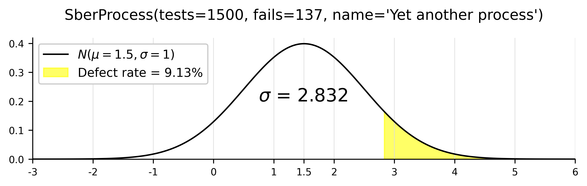

## Simple web app to evaluate a process with the SIX SIGMA approach

#### Response headers
```
content-disposition: inline; filename=chart.png
content-length: 202669
content-type: image/png
date: Thu,31 Oct 2024 06:59:23 GMT
process-defect-rate: 0.09133333333333334
process-fails: 137
process-label: YELLOW
process-name: Yet another process
process-sigma: 2.8325891531603973
process-tests: 1500
...
```

#### Response body

